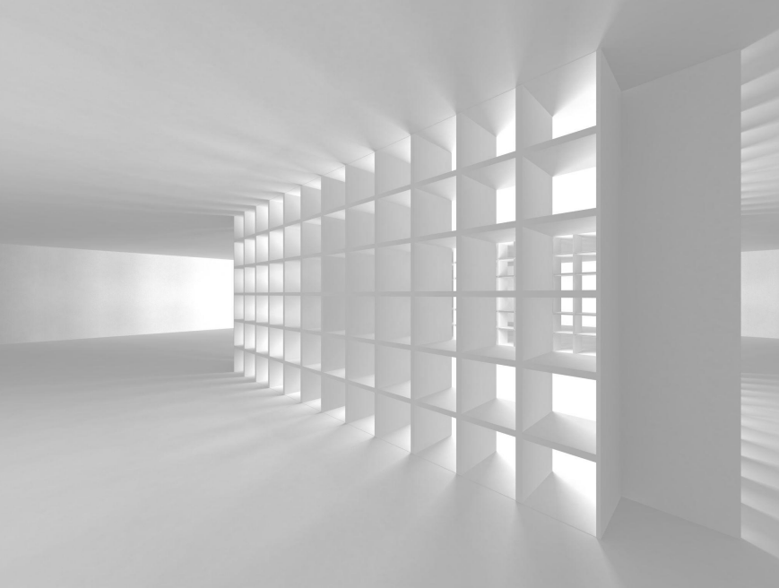

# Handoff — Apply architectural-white image as main landing-page background

**Date:** 2026-04-19  
**Prior context:** Landing page just shipped Direction C — "The Statement" (spec at `apps/web/docs/superpowers/specs/2026-04-19-larry-landing-redesign-design.md`, implementation at PR #138 merged to master as `f626f32`).  
**User intent:** *"I really want this image from the PDF to be the main background on the landing page."*

---

## Prompt to the next agent

Use the architectural-white image already saved at `apps/web/public/landing-bg-architecture.png` as the main background of the landing page (`/`). This image was called out by the user in the original PDF brief as the atmosphere they want for the site — clean, minimal, editorial, white on white with geometric depth.

Drive this end-to-end: read the existing design, decide the right layering, implement it, verify on Vercel preview, and handle the licensing question before it ships to production.

---

## Reference image



A rendering of a bright, receding gallery/exhibition hall with repeating cubic wall niches. Predominantly white with soft grey shadow edges creating depth. The existing landing page palette (`#6c44f6` brand purple on near-white `#ffffff` body) lives comfortably on top of this atmosphere.

- **File:** `apps/web/public/landing-bg-architecture.png`  
- **Current size:** ~188 KB PNG, 870×656 (approx). **Not yet optimized** — see "Required optimization" below.

---

## Constraints (hard)

1. **Do not regress text readability.** Body text is `#11172c` (near-black navy) and `#4b556b` (secondary). Eyebrow labels are `#bdb7d0` (already near-white). On the image's light regions these work; on the image's darker shadow regions they may drop below WCAG AA. Apply a semi-transparent white overlay (60–85%, whatever passes the contrast test) if needed.
2. **Brand purple must still hit.** `#6c44f6` on the CTA buttons, icons, strokeDraw underline, and comparison-section purple dots must read as vivid and intentional. Test especially on the hero.
3. **Preserve the `<LiquidBackground>` aurora or make an intentional decision to retire it.** Don't leave both fighting for attention — they'll muddy each other. My recommendation: retire the aurora on the landing page only (keep it on `/pricing` and `/careers` for now) OR keep the aurora and drop the image opacity to ~60% so the aurora reads through.
4. **Dark sections must remain dark.** `<ComparisonSection>` uses warm stone `#F2F2EF`, `<CTASection>` uses near-black `#11172c`, footer uses `#11172c`. These must fully cover the background image (not translucent) so their dark identities stay intact.
5. **Mobile (375px) must look intentional.** Full-bleed architectural images routinely look awkward on small screens. Decide: `object-cover` with a focal-point (`object-position: center` is fine for this image), or switch to a simpler fallback on small viewports, or use a crop variant.
6. **Respect `prefers-reduced-motion`.** No animated parallax or ken-burns effect unless it's also still and pleasant with reduced motion.

---

## Required optimization (non-negotiable before merge)

The current PNG is 188 KB but this is the **wrong format** for a hero background:

- Convert to **AVIF** (primary) + **WebP** (fallback) + keep PNG as final fallback, OR let `next/image` do format negotiation automatically.
- Target: **under 80 KB** for the AVIF at 1920×1080 — the image is mostly flat white, so it compresses brutally well.
- Use `<Image fill priority sizes="100vw" />` or a CSS `background-image` with a `<picture>` element. With `next/image`, `priority={true}` on a background hero to avoid LCP regression.
- After shipping, check Lighthouse / PageSpeed — this image should NOT push LCP over 2.5s on mobile 4G.

---

## Decisions you need to make (and document in the commit message)

1. **Scope:** whole-page background, or hero-only, or hero + fade-out?  
   *Default suggestion:* whole-page but at reduced opacity (~50%), anchored `fixed` or `absolute` behind everything, so it feels like ambient atmosphere rather than a literal photo of a room.
2. **Aurora retirement:** keep `<LiquidBackground>` or drop it on the landing page?  
   *Default suggestion:* drop on `/` only — the image IS the ambient layer now. Keep on `/pricing` and `/careers`.
3. **Overlay strength:** 40% white tint? 60%? 80%? Depends on how much of the image you want readable. Start at 60% white overlay on top of the image, tune by eye on preview.
4. **Dark-section treatment:** how does the image behave in `<ComparisonSection>` (warm stone), `<CTASection>` (dark), footer (dark)? They should cover the image fully. Confirm this is still the case and nothing bleeds through.
5. **Fixed vs scroll:** `background-attachment: fixed` gives a subtle parallax. `scroll` moves with the page. Pick one. On mobile, `fixed` is iOS-buggy — prefer `scroll` on mobile.

---

## Suggested implementation sketch (adjust as needed)

```tsx
// apps/web/src/components/layout/LandingRoot.tsx
"use client";
import Image from "next/image";
import { useEffect } from "react";

export function LandingRoot({ children }: { children: React.ReactNode }) {
  useEffect(() => {
    document.body.classList.add("landing-root");
    return () => document.body.classList.remove("landing-root");
  }, []);
  return (
    <>
      <div
        aria-hidden="true"
        className="pointer-events-none fixed inset-0 -z-30"
      >
        <Image
          src="/landing-bg-architecture.png"
          alt=""
          fill
          priority
          sizes="100vw"
          className="object-cover opacity-50"
          // Focal point: centre is fine for this image.
          style={{ objectPosition: "center" }}
        />
        {/* White overlay to tone down the image and keep text legible. */}
        <div className="absolute inset-0 bg-white/60" />
      </div>
      {children}
    </>
  );
}
```

Then consider:
- If you keep `<LiquidBackground>` (at `-z-50` currently), the image at `-z-30` will sit OVER the aurora. Flip the ordering or drop the aurora.
- Update `globals.css` `body.landing-root { background: #ffffff; }` — the image now provides the visual background so the solid white override may be unnecessary, or might be fine as a fallback before the image loads.

---

## Licensing — address before shipping

**The image came from Anna's PDF brief.** Its original source is unknown. Before committing it to the production repo:

- Find the original source. Is it a Shutterstock/Adobe Stock/Unsplash/own render?
- If stock: buy a commercial license or remove the file.
- If Unsplash/CC: verify attribution requirements (if any) and comply.
- If unknown: treat as unlicensed; commission a custom render or use a licensed alternative. Good architectural-white alternatives exist on Unsplash under the search terms "white architecture minimal" or "white exhibition space".

**Do NOT ship to production until this is resolved.** Run the implementation on `feat/landing-bg-image` and pause before merge for a licensing check.

---

## Workflow

1. Branch off master: `git checkout master && git pull && git checkout -b feat/landing-bg-image` — or use a worktree like we did for the redesign.
2. Implement the changes above.
3. Optimize the image (AVIF + WebP, reduce file size).
4. Verify on Vercel preview at desktop and mobile.
5. Confirm licensing before opening the PR. Note the source + license in the PR description.
6. Open PR against master.

---

## Acceptance criteria

- [ ] Image renders as the atmospheric layer behind all landing-page content
- [ ] No text contrast regression (WCAG AA preserved on all sections)
- [ ] Brand purple hits remain vivid
- [ ] `<LiquidBackground>` decision made and documented
- [ ] Dark sections (`<ComparisonSection>`, `<CTASection>`, footer) still read as dark, not bleed-through
- [ ] Mobile 375px crop looks intentional
- [ ] LCP on mobile ≤ 2.5s (verified via Lighthouse)
- [ ] Image optimized (AVIF + WebP, file sizes documented in PR)
- [ ] Licensing verified and documented in the PR description
- [ ] `prefers-reduced-motion` respected (no jarring parallax)
- [ ] `/pricing` and `/careers` still work — decision made about whether image applies there too

---

## Scope NOT in this handoff

- Do not touch `/pricing` or `/careers` unless you've decided the image applies there too (document the decision either way).
- Do not change the existing design tokens, typography, or component layout.
- Do not rewire forms, overlays, or API routes.
- If you discover the image doesn't work visually at any density/opacity, report back — we can pivot to a different image or a different atmospheric approach rather than shipping something that doesn't land.
